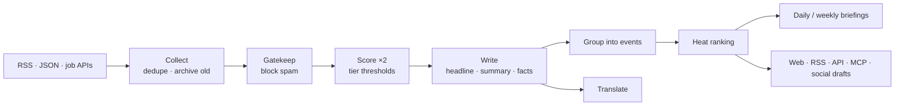

# HotPulse

**A self-hosted news radar that runs a free local AI.** HotPulse reads dozens of sources, keeps only what matters, groups reports about the same event, ranks stories by how many independent sources cover them, and publishes multilingual daily briefings with RSS, a JSON API and an MCP server for AI agents.

It ships with three channels, and you can add your own with one YAML file:

| Channel | What it tracks |
|---|---|
| **Global AI** | Model releases, research, products, funding, policy |
| **Jobs & Scholarships** | Scholarships, fellowships, remote jobs, internships, with **deadlines, funding and "open to Pakistan"** extracted |
| **Pakistan Tech** | Startups and funding, telecom, fintech, freelancing and IT exports, digital policy |


<table><tr>
<td></td>
<td width="28%"></td>
</tr></table>

> Screenshots use the built-in **demo data**. Every company and number in it is fictional.

---

## Features

- **Free, private AI.** Runs on [Ollama](https://ollama.com) on your own machine, with no API bills. If no model is running, transparent keyword rules take over, so it works from minute one.
- **Two independent scores per story.** The sum must clear a bar that is lower for official sources (T1) and higher for aggregators (T3).
- **Story grouping.** Reports about the same event are merged into one story. Matching uses headline overlap, shared rare names (startups, model names), optional embeddings, and the model as a tie-breaker.
- **Heat ranking.** Breadth of independent coverage × quality × time decay, so ten articles from one site can't fake a trend.
- **Opportunities mode.** Extracts deadline, funding type, eligibility and location, and whether Pakistani applicants can apply. Expired items are never picked. Includes a "closing soon" list.
- **Multilingual.** English first; Urdu, Arabic, Hindi, Chinese, Spanish, French, Turkish, Indonesian and Bengali. The layout switches to RTL automatically. Picks are pre-translated into your chosen languages, and anything else translates on click (cached forever).
- **Daily and weekly briefings.** Ranking is rule-based. The AI only writes a short intro, and the intro is rejected if it contains numbers that aren't in the stories.
- **Social drafts.** Ready-to-post X (under 280 characters with the link) and Threads posts for your top stories, to grow your accounts with your own content.
- **For machines too.** RSS per channel and per briefing, a JSON API with OpenAPI docs, `llms.txt`, a sitemap, and an **MCP server** with 5 tools.
- **Admin panel.** Run the pipeline, see failing sources, add feeds, override picks, re-analyse items, and copy social drafts.
- **Safety by design.** Article text is wrapped as untrusted `<material>` (protects against prompt injection), links the model invents are dropped, model answers are cached so a restart never redoes paid or slow work, and one broken feed never stops the rest.

## Quick start (5 minutes)

You need **Python 3.10+**.

```bash
git clone https://github.com/<you>/hotpulse.git
cd hotpulse
pip install -e .
cp .env.example .env          # Windows: copy .env.example .env

hotpulse demo                 # fictional sample data, works offline
hotpulse serve                # → http://127.0.0.1:8000
```

When you're ready for real news:

```bash
hotpulse demo --clear
hotpulse sources --test       # check which feeds are reachable from your network
hotpulse serve                # collects every 30 minutes in the background
```

### Turn on the AI (free)

1. Install Ollama from https://ollama.com/download
2. Pull a model that fits your machine:

   | Your RAM / GPU | Model | Command |
   |---|---|---|
   | 8 GB | small, fast | `ollama pull qwen2.5:3b` |
   | 16 GB (default) | good balance | `ollama pull qwen2.5:7b` |
   | 24 GB+ or a GPU | best quality | `ollama pull qwen2.5:14b` |

   Any Ollama chat model that can answer in JSON works. Qwen models are recommended because their Urdu and other non-English output is strong.
3. Set `OLLAMA_MODEL` in `.env` to match, then run `hotpulse doctor` to check everything.

Optional: `ollama pull nomic-embed-text` and set `OLLAMA_EMBED_MODEL=nomic-embed-text` for better story grouping.

### Docker (site + Ollama together)

```bash
echo "ADMIN_TOKEN=pick-a-long-password" >> .env
docker compose up -d          # first run downloads the model
```

## How it works



| Step | File | Notes |
|---|---|---|
| Collect | `hotpulse/collect.py` | Canonical URLs + headline hash dedupe. Items older than 72 h, and a new source's backlog, are archived, never shown as "today". |
| Judge & write | `hotpulse/analyze.py` | Prefilter → two scores (different seeds/temperatures) → structure and summary. A heuristic fallback runs at every step. |
| Group & heat | `hotpulse/events.py` | Heat = Σ tier weights of distinct sources × (0.5 + score/100) × half-life decay of 24 h. |
| Briefings & social | `hotpulse/digest.py` | One entry per event, max 2 per source, "closing soon" for opportunities. |
| Prompts | `config/prompts/*.md` | Plain text. Edit them to change the editorial taste without touching code. |

## Make it yours

Everything site-specific lives in `config/`:

- **`config/site.yaml`**: name, tagline, timezone, languages, auto-translate list, schedule.
- **`config/channels/<key>.yaml`**: one file per channel: description, **rubric** (what your readers value), thresholds per tier, keywords, categories and sources.
- **`config/prompts/`**: every instruction the model gets.

Example: add a "Climate" channel by copying `ai.yaml` to `climate.yaml`, changing the rubric, categories and sources, and adding `climate` to `channels:` in `site.yaml`. Restart, and it appears in the menu, the API, RSS and MCP.

**Tuning tips**

- Too many weak picks? Raise the thresholds. Missing good stories? Describe that kind of value more clearly in `rubric`, which works better than lowering the thresholds.
- Use **T1** for official, first-party sources, **T2** for good media, **T3** for aggregators like Google News or Hacker News.
- The admin **Items** page shows both scores and the model's reason for every item.

## API & MCP

| Endpoint | |
|---|---|
| `GET /api/v1/items?channel=ai&category=models&lang=ur` | Picks (`all=true` for everything) |
| `GET /api/v1/events/hot?days=3` | Events by heat |
| `GET /api/v1/opportunities?within_days=14&open_to_pakistan=true` | Open opportunities by deadline |
| `GET /api/v1/search?q=scholarship` | Full-text search (SQLite FTS5) |
| `GET /api/v1/digests/{channel}/daily/latest` | Latest briefing |
| `/feed.xml`, `/feed/{channel}.xml`, `/feed/{channel}/daily.xml` | RSS |
| `POST /mcp` | MCP (Streamable HTTP): `latest_news`, `search_news`, `hot_events`, `daily_briefing`, `open_opportunities` |

Interactive docs are at `/api/docs`. To connect Claude Desktop or another MCP client, point it at `http://your-site/mcp`.

## Commands

```
hotpulse init                 create DB, load sources
hotpulse run [--channel ai]   one full cycle now
hotpulse serve [--host 0.0.0.0 --port 8000 --no-scheduler]
hotpulse demo [--ai | --clear]
hotpulse digest [--today] [--kind weekly] [--channel X]
hotpulse sources [--test]
hotpulse doctor               check config, Ollama and the model
```

## Deploying publicly

1. Set a long random `ADMIN_TOKEN` and your real `SITE_URL` in `.env`. The default token only works on localhost.
2. Run with Docker, or `hotpulse serve --host 0.0.0.0` behind Caddy or Nginx with HTTPS.
3. A small VPS (4 GB RAM) runs the site plus `qwen2.5:3b`. For bigger models, run Ollama on a machine with a GPU and point `OLLAMA_URL` at it.

## Development

```bash
pip install -e ".[dev]"
pytest -q        # 56 tests, no network: fake feeds + a fake Ollama server
```

The project layout is small on purpose: about 3,400 lines of Python, SQLite, Jinja templates, one CSS file and one JS file, with no build step.

## Credits

Inspired by the ideas in [AIHOT](https://github.com/KKKKhazix/AIHOT) (MIT): dual scoring, event grouping and source-diversity heat. HotPulse is an independent rewrite in Python with a different stack and feature set. No AIHOT code, prompts or branding are included (see `NOTICE`).

MIT License.
