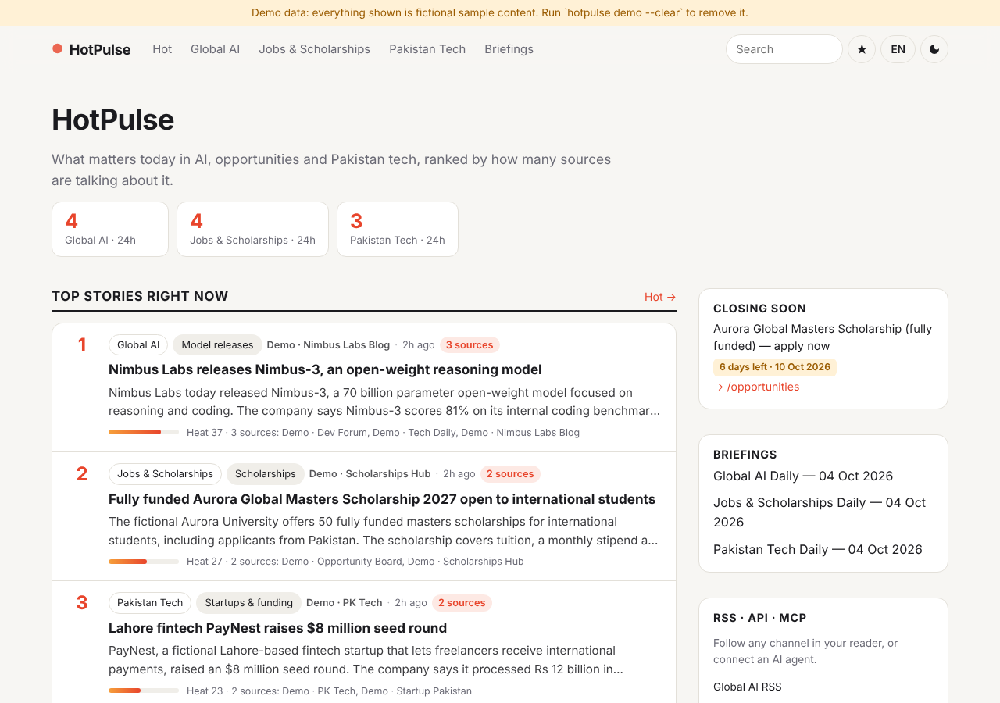
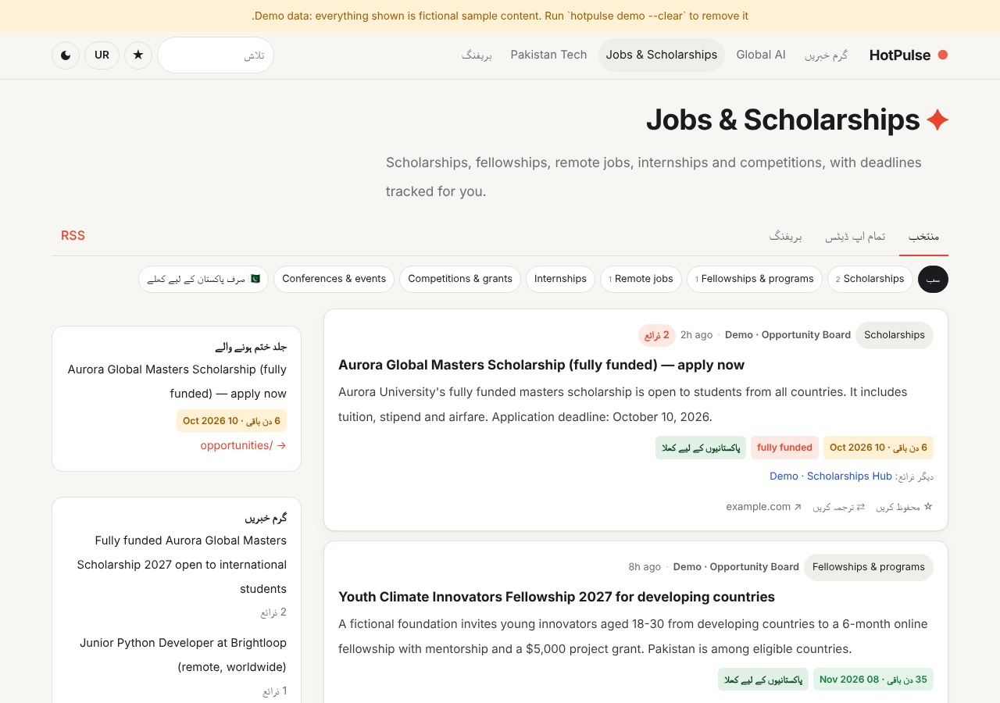
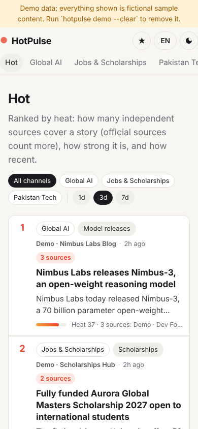
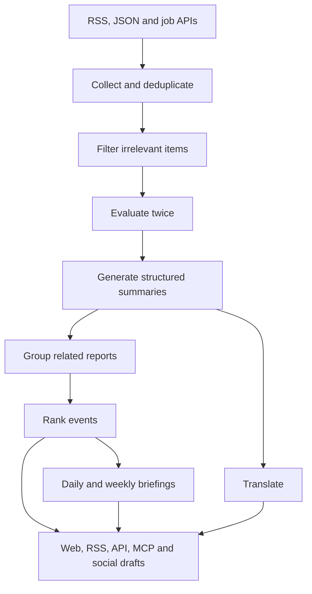

# HotPulse

**A self-hosted AI news radar powered by Ollama.**

Turn noisy headlines into useful daily briefings. HotPulse collects news from multiple sources, filters relevant stories, groups reports about the same event, and ranks coverage by source diversity, quality and freshness.

Run it locally with no paid AI API required. Read your briefings on the web or access them through RSS, a JSON API and an MCP server.

## See it in action



<table>
  <tr>
    <td>
      
    </td>
    <td width="28%">
      
    </td>
  </tr>
</table>

> Screenshots show built-in demo data. Companies and figures in the demo are fictional.

## Built-in channels

| Channel | What it tracks |
|---|---|
| **Global AI** | Model releases, research, products, funding and policy |
| **Jobs & Scholarships** | Scholarships, fellowships, remote jobs and internships, with extracted deadlines, funding and eligibility information |
| **Pakistan Tech** | Startups, funding, telecom, fintech, freelancing, IT exports and digital policy |

Add your own channel through YAML configuration.

## Features

- **Local AI with a fallback.** Use Ollama on your own machine without paid AI APIs. If the model is unavailable, keyword-based rules keep the pipeline working.
- **Two-pass scoring.** Each story receives two model evaluations using different generation settings. Their combined score must meet a source-tier threshold.
- **Event grouping.** Related reports are grouped using headline overlap, shared distinctive names, optional embeddings and a model-assisted tie-breaker.
- **Source-aware ranking.** Stories rank by distinct-source coverage, source quality, relevance and freshness. Repeated articles from one source do not count as independent coverage.
- **Opportunity tracking.** Extract deadlines, funding, eligibility and location, including whether Pakistani applicants can apply. Items identified as expired are excluded from picks.
- **Ten languages.** English, Urdu, Arabic, Hindi, Chinese, Spanish, French, Turkish, Indonesian and Bengali, with automatic right-to-left layouts where appropriate.
- **Cached translations.** Pre-translate selected stories into configured languages or translate other items on demand.
- **Daily and weekly briefings.** Rule-based selection with an AI-written introduction. A numeric consistency check rejects introductions containing numbers absent from the selected stories.
- **Social drafts.** Generate X and Threads drafts for selected stories.
- **RSS, API and MCP.** Channel feeds, briefing feeds, documented JSON endpoints and five MCP tools.
- **Admin controls.** Run the pipeline, inspect failing sources, add feeds, override picks, re-analyse items and copy social drafts.
- **Resilient processing.** Cache model responses, isolate feed failures and validate generated output.

## Quick start

Requires **Python 3.10+**.

```bash
git clone https://github.com/hamza01055/hotpulse.git
cd hotpulse

python -m venv .venv
```

Activate the virtual environment:

```bash
# Linux / macOS
source .venv/bin/activate

# Windows PowerShell
.venv\Scripts\Activate.ps1
```

Install and configure:

```bash
pip install -e .
```

Copy `.env.example` to `.env`:

```bash
# Linux / macOS
cp .env.example .env

# Windows PowerShell
Copy-Item .env.example .env
```

Start with fictional sample data:

```bash
hotpulse demo
hotpulse serve
```

Open **http://127.0.0.1:8000**.

### Switch to real news

Stop the server, then run:

```bash
hotpulse demo --clear
hotpulse sources --test
hotpulse serve
```

With the default schedule, HotPulse collects news every 30 minutes while the server is running.

## Enable local AI

1. Install [Ollama](https://ollama.com/download).
2. Download a model:

```bash
ollama pull qwen2.5:3b
```

3. Set the matching model in `.env`:

```dotenv
OLLAMA_MODEL=qwen2.5:3b
```

4. Check your configuration:

```bash
hotpulse doctor
```

Larger alternatives include:

```bash
ollama pull qwen2.5:7b
ollama pull qwen2.5:14b
```

Start with the smaller model and increase the size if your machine has enough available memory. Requirements and processing speed vary with model quantization, context length, hardware and workload.

Other Ollama chat models may work if they reliably produce the required JSON output.

### Optional embeddings

For embedding-assisted story grouping:

```bash
ollama pull nomic-embed-text
```

Set:

```dotenv
OLLAMA_EMBED_MODEL=nomic-embed-text
```

## Docker

Copy `.env.example` to `.env`, then set a long random admin token:

```dotenv
ADMIN_TOKEN=replace-with-a-long-random-secret
```

Start the site and Ollama:

```bash
docker compose up -d
```

The first startup downloads the configured model and may take longer.

## How it works



| Stage | File | Behaviour |
|---|---|---|
| Collection | `hotpulse/collect.py` | Deduplicates canonical URLs and headline hashes; archives old items and initial source backlogs |
| Analysis | `hotpulse/analyze.py` | Prefilters items, evaluates twice and produces structured summaries, with heuristic fallbacks |
| Grouping and ranking | `hotpulse/events.py` | Groups reports and calculates heat from distinct sources, scores and time decay |
| Briefings and social drafts | `hotpulse/digest.py` | Selects one entry per event, limits source repetition and highlights approaching deadlines |
| Model instructions | `config/prompts/*.md` | Editable prompts for scoring, writing and related tasks |

Heat combines the tier weights of distinct sources, a score multiplier and a freshness decay with a 24-hour half-life.

## Make it yours

Configuration lives in `config/`:

| Path | Purpose |
|---|---|
| `config/site.yaml` | Site name, tagline, timezone, languages and schedule |
| `config/channels/<key>.yaml` | Channel rubric, thresholds, keywords, categories and sources |
| `config/prompts/` | Model instructions |

To add a Climate channel:

1. Copy `config/channels/ai.yaml` to `config/channels/climate.yaml`.
2. Update its rubric, categories, keywords and sources.
3. Add `climate` to the channel list in `config/site.yaml`.
4. Restart HotPulse.

### Tuning

- Raise thresholds if too many weak stories are selected.
- Refine the rubric when valuable stories are missed.
- Use **T1** for official sources, **T2** for established reporting and **T3** for aggregators.
- Inspect both scores and their explanations on the admin Items page.

## API and MCP

| Endpoint | Purpose |
|---|---|
| `GET /api/v1/items?channel=ai&category=models&lang=ur` | Selected items; use `all=true` to include other items |
| `GET /api/v1/events/hot?days=3` | Events ranked by heat |
| `GET /api/v1/opportunities?within_days=14&open_to_pakistan=true` | Opportunities filtered by deadline and eligibility |
| `GET /api/v1/search?q=scholarship` | SQLite FTS5 full-text search |
| `GET /api/v1/digests/{channel}/daily/latest` | Latest daily briefing |
| `/feed.xml` | Main RSS feed |
| `/feed/{channel}.xml` | Channel RSS feed |
| `/feed/{channel}/daily.xml` | Daily briefing RSS feed |
| `POST /mcp` | Streamable HTTP MCP endpoint |

Interactive API documentation: **`/api/docs`**

Available MCP tools:

- `latest_news`
- `search_news`
- `hot_events`
- `daily_briefing`
- `open_opportunities`

For a client supporting Streamable HTTP, configure:

```text
http://127.0.0.1:8000/mcp
```

Connection steps depend on the MCP client and version.

## Commands

```text
hotpulse init
hotpulse run [--channel ai]
hotpulse serve [--host 0.0.0.0 --port 8000 --no-scheduler]
hotpulse demo [--ai | --clear]
hotpulse digest [--today] [--kind weekly] [--channel X]
hotpulse sources [--test]
hotpulse doctor
```

## Public deployment

1. Set a long random `ADMIN_TOKEN` and your public `SITE_URL` in `.env`.
2. Deploy with Docker, or run `hotpulse serve --host 0.0.0.0` behind an HTTPS reverse proxy such as Caddy or Nginx.
3. Size the host for both the application and your chosen model.

You can run Ollama on a separate machine and configure `OLLAMA_URL` accordingly. Keep that connection private or appropriately protected.

## Reliability and limitations

- Two evaluations provide an additional filtering step; they are not independent fact-checks.
- Article content is marked as untrusted material in prompts. This is a mitigation, not a guarantee against prompt injection.
- Generated links are validated, and unsupported links are dropped.
- Model responses are cached to reduce repeated processing.
- Feed failures are isolated so other sources can continue.
- Summaries, translations and extracted eligibility may contain errors. Check the original source before applying for an opportunity.
- Local inference avoids sending article content to a paid model API, but collecting live feeds still requires network requests.

## Development

```bash
pip install -e ".[dev]"
pytest -q
```

The test suite includes **56 automated tests**, using fake feeds and a fake Ollama server without live network access.

The stack uses Python, FastAPI, SQLite, Jinja templates, CSS and JavaScript, with no frontend build step.

## Support and feedback

Found a bug or have a feature idea? [Open an issue](https://github.com/hamza01055/hotpulse/issues).

If HotPulse is useful to you, consider giving the repository a ⭐.

## Credits

Inspired by ideas from [AIHOT](https://github.com/KKKKhazix/AIHOT), including dual scoring, event grouping and source-diversity ranking.

HotPulse is an independent Python rewrite with a different stack and feature set. No AIHOT code, prompts or branding are included; see `NOTICE`.

## License

MIT License.
